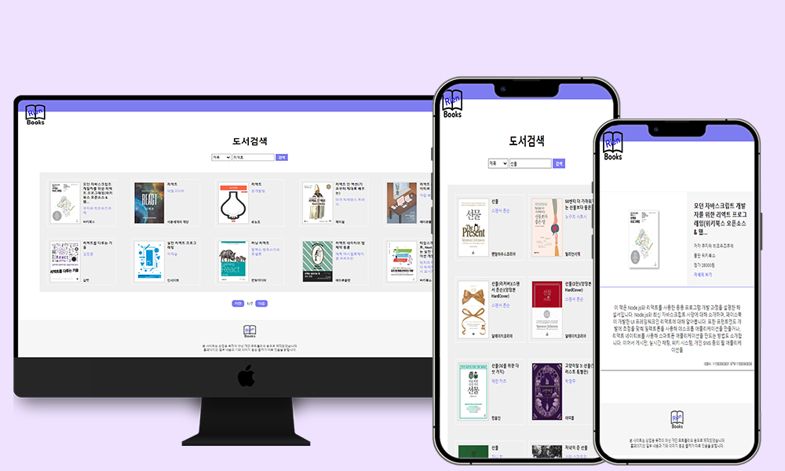

# 안녕하세요 신입 웹 프론트엔드 개발자 성해련 입니다.

<br>

### Rien_books 창작
### "Rest API 활용 도서 검색 서비스"

<br>



<br>

- Demo : https://hi-rien.github.io/rien_books/


<br>

---

### 개발 목표
  - KAKAO Rest API를 활용한 도서 검색 React페이지 구현

  <br>

### 사용 기술
  - HTML
  - CSS
  - React
  - Rest API
  - Figma

  <br>

## Point

**KAKAO API를 받아 도서 검색 기능 구현**

<br>

API 호출
```jsx

  const REST_API_KEY = "6fa6cd762f56f824defac792de87367a"

  const[query,setQuery] = useState('선물');
  const[page,setPage] = useState(1);
  const[last,setLast] = useState(1);
  const[target,setTarget] = useState('title')
  const [documents,setDocuments] = useState(null);
  
  const callAPI = async() =>{
      const url = `https://dapi.kakao.com/v3/search/book?target=${target}&query=${query}&page=${page}`;
      const config = {headers:`Authorization: KakaoAK ${REST_API_KEY}`};
      const result = await axios(url,config);
      setDocuments(result.data.documents);
      const total = result.data.meta.pageable_count;
      setLast(Math.ceil(total/10))
      console.log(result.data.documents)
  }

    useEffect(()=>{
      callAPI();
  },[page])

```

<br>

API호출 하여 받은 값을 map함수를 이용해 자식 컴포넌트로 전송
```jsx
<div className='documents'>
  {documents.map(d=>(
    <Result 
      key={d.isbn}
      title={d.title}
      authors={d.authors}
      publisher={d.publisher}
      thumbnail={d.thumbnail}
      contents={d.contents}
      price={d.price}
      isbn = {d.isbn}
      url = {d.url}
      />
  ))}
</div>
```